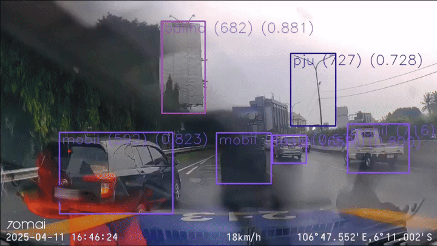
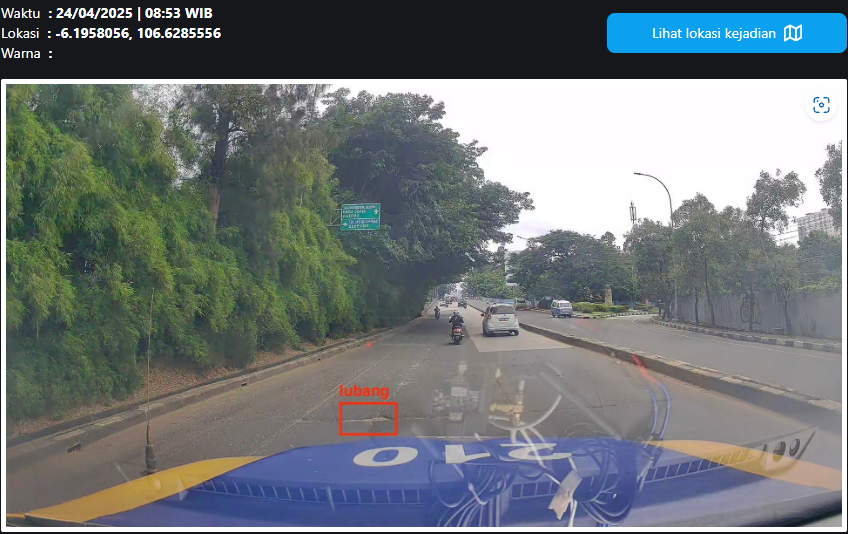
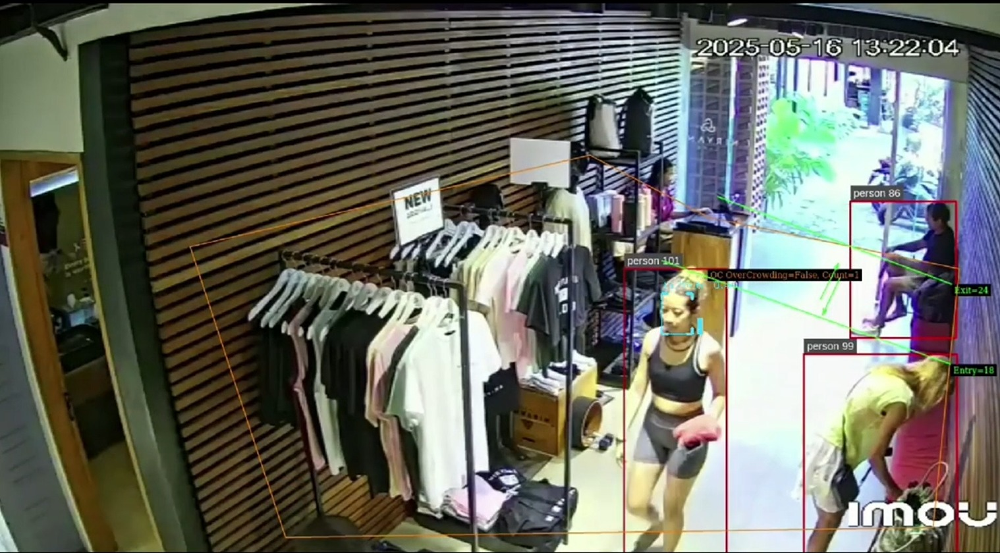
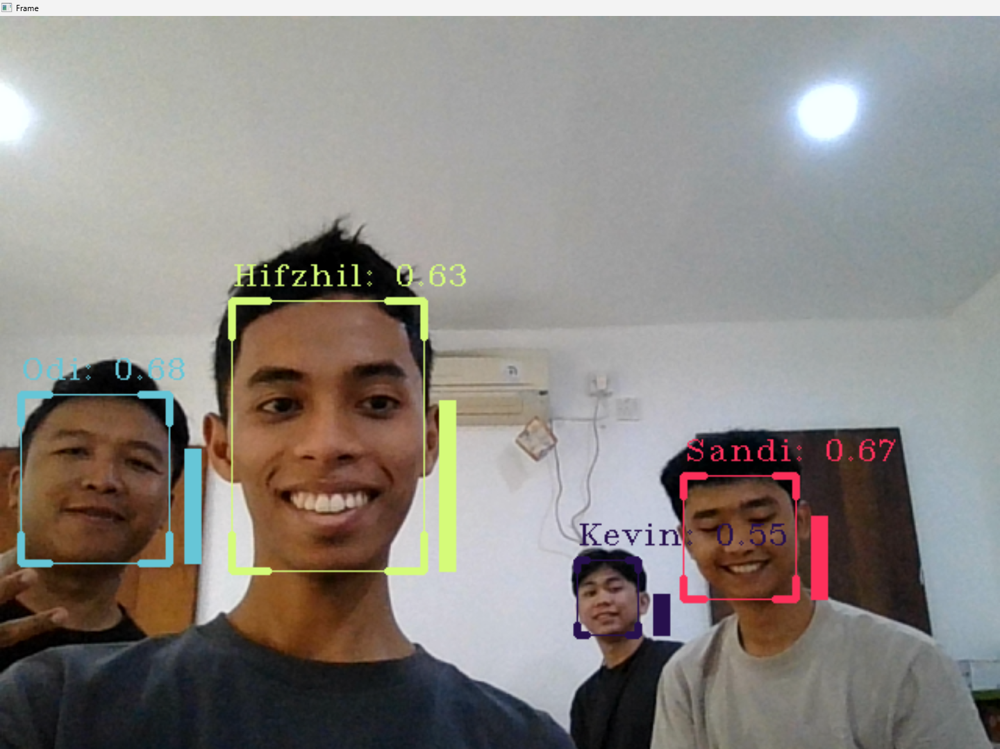

# Hifzhil's Engineering Portfolio

## About Me
I am a skilled engineer specializing in IoT, embedded systems, and smart city solutions. My work focuses on developing innovative solutions that bridge the gap between hardware and software, creating impactful projects in areas such as traffic management, building automation, and robotics.

## Featured Projects

### Smart City & IoT Solutions

#### 1. Smart Dashcam for Toll Road Monitoring

An intelligent camera system designed for comprehensive toll road monitoring and management, combining real-time analytics with GPS tracking.

**System Demo:**

*Real-time vehicle detection and tracking system in action*

**Core Features:**
- Advanced vehicle detection and classification
- Real-time traffic flow analysis
- GPS-based vehicle tracking
- Automated toll collection integration
- Anomaly detection and incident reporting
- Historical data analytics

**Analytics Dashboard:**

*GPS-based vehicle tracking and route analysis*

**Incident Management:**

*Real-time anomaly detection and event reporting interface*

**Technical Specifications:**
- High-resolution camera system with night vision capability
- AI-powered vehicle recognition algorithms
- GPS module for precise location tracking
- Edge computing for real-time processing
- Cloud integration for data storage and analysis

**Key Applications:**
- Traffic flow optimization
- Toll collection automation
- Vehicle speed monitoring
- Incident detection and response
- Traffic pattern analysis
- Revenue management

**Benefits:**
- Improved toll road efficiency
- Enhanced traffic safety
- Reduced operational costs
- Data-driven decision making
- Streamlined incident response
- Better user experience for drivers

#### 2. Smart Traffic Light for Traffic Monitoring

An adaptive traffic light system that optimizes traffic flow based on real-time monitoring.
- Real-time traffic density analysis
- Adaptive signal timing
- Integration with traffic management systems

#### 3. Smart Pole for Smart City Applications

A multi-functional smart pole system for urban environment monitoring.
- Environmental parameter monitoring
- Public safety features
- Integrated city infrastructure management

#### 4. Smart Building System

A comprehensive building management system with advanced features, specifically designed for modern gym facilities and smart buildings.

**Key Features:**
- Advanced facial recognition for member identification and access control
- Real-time occupancy tracking and management
- Automated member check-in/check-out system
- Digital member profile management
- Building automation and environmental control

**Technical Implementation:**
- Computer vision-based facial recognition using OpenCV
- Real-time processing and member verification
- Secure member database integration
- User-friendly interface for staff and administrators

**Project Screenshots:**

*Real-time facial recognition system in action*

*Member profile and information management interface*

*Facial reidentification research*

**Demo:**
[Watch Demo Video](assets/demo-vid.mp4)

**System Components:**
- Facial recognition cameras at entry/exit points
- Member database management system
- Real-time occupancy monitoring dashboard
- Environmental control systems
- Access control integration

**Benefits:**
- Enhanced security through biometric verification
- Streamlined member check-in process
- Improved facility utilization tracking
- Data-driven insights for business optimization
- Reduced operational overhead

### Robotics & Automation

#### 5. Dental Assistant Robot

An innovative dental assistance system combining ESP32 and 3D printed robotics.
- Custom 3D printed robotic arm
- ESP32-based control system
- Dental procedure automation

#### 6. Robotic Mouth Openness Detection

Advanced detection system for monitoring mouth movements.
- Real-time tracking algorithms
- Medical application integration
- Computer vision implementation

### Embedded Systems

#### 7. STM32 Electronic Control Unit

Custom ECU development using STM32 microcontroller.
- Vehicle systems control
- Real-time monitoring
- Sensor integration

#### 8. Water Level and Pressure Logger

Smart building water management system.
- Real-time water level monitoring
- Pressure tracking
- Data logging and analysis

### Simulation

#### 9. Car Simulator

Virtual car simulation environment for testing and development.
- Physics-based vehicle dynamics
- Real-time simulation
- Testing and validation platform

## Technical Skills
- **IoT & Embedded Systems**: ESP32, STM32, Sensor Integration
- **Programming Languages**: C/C++, Python
- **Hardware Design**: PCB Design, 3D Printing
- **Computer Vision**: OpenCV, Image Processing
- **Robotics**: Robot Control Systems, Automation
- **Smart City Technologies**: Traffic Systems, Building Automation
- **Data Analysis**: Real-time Monitoring, Data Logging

## Contact & Links
- [GitHub](https://github.com/hifzhil)
- [LinkedIn](#) <!-- Add your LinkedIn profile link -->
- Email: <!-- Add your professional email -->

## Achievements & Certifications
<!-- Add any relevant certifications, awards, or recognition -->

---
*This portfolio is currently being expanded into a full Vue.js application. Stay tuned for updates!* 